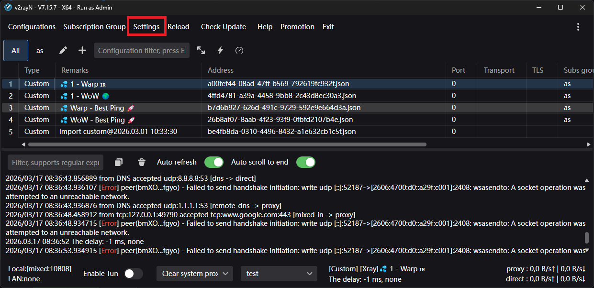
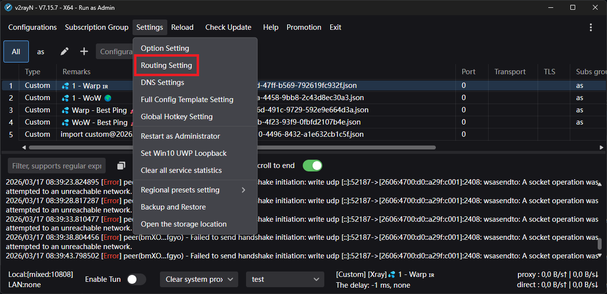
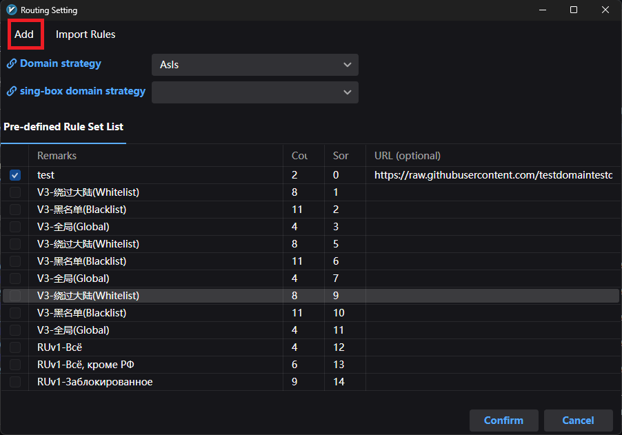
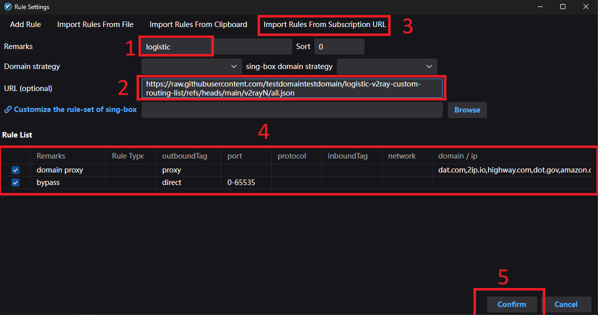
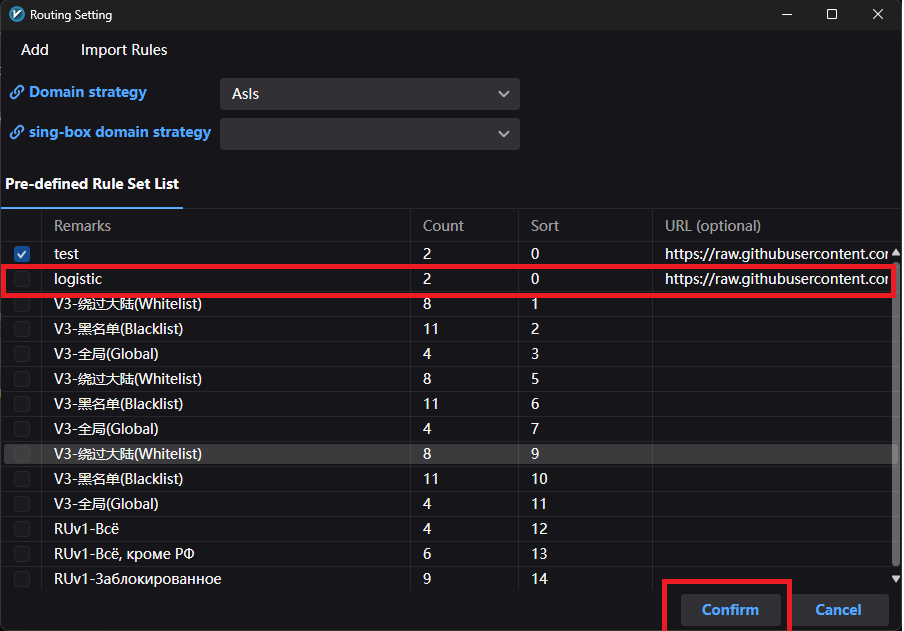
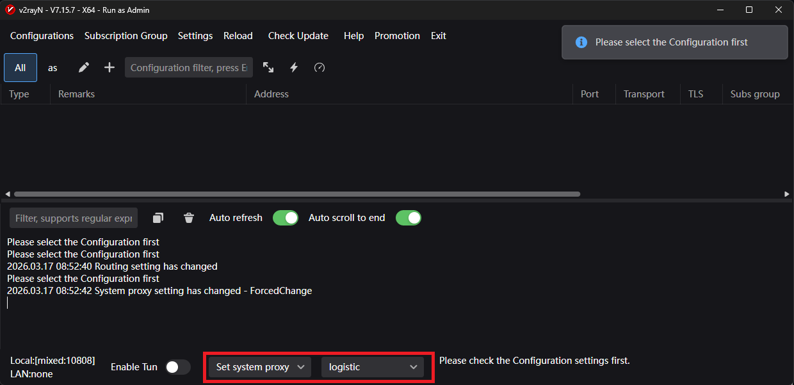
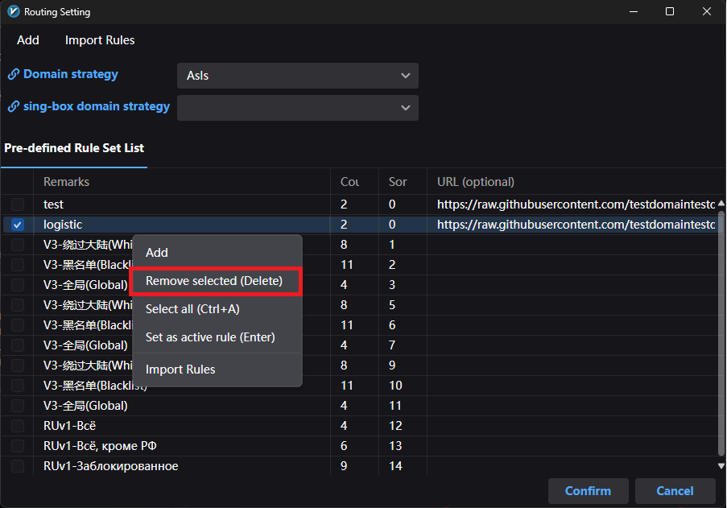

****
# Инструкция по добавлению списка
### Шаг 1: Зайти в настройки управления маршрутами внутри V2rayn  
  
  
  
  
  
### Шаг 2: Добавить правило маршрутизации  
  
  
#### Ссылка для добавления
```bash
https://raw.githubusercontent.com/testdomaintestdomain/logistic-v2ray-custom-routing-list/refs/heads/main/v2rayN/all.json
```  
**Ссылку нужно вставлять в то место где показано на скриншоте и нажимать кнопки надо в той последовательности что на скриншоте. И да для поля remarks вы можете написать все что угодно (это просто названия правил).**



#### После добавления правило появиться в списке правил  
  


### Шаг 3: Выбрать правило маршрутизации  
#### Set system proxy это опционально (можно попробывать если не работает tun mode)  
  

  
# Инструкция по обновлению списка  
### Шаг 1: Удалить правило из списка  
  

После удаления вернуться к шагу 2 инструкции по добавлению списка и выполнить все шаги
